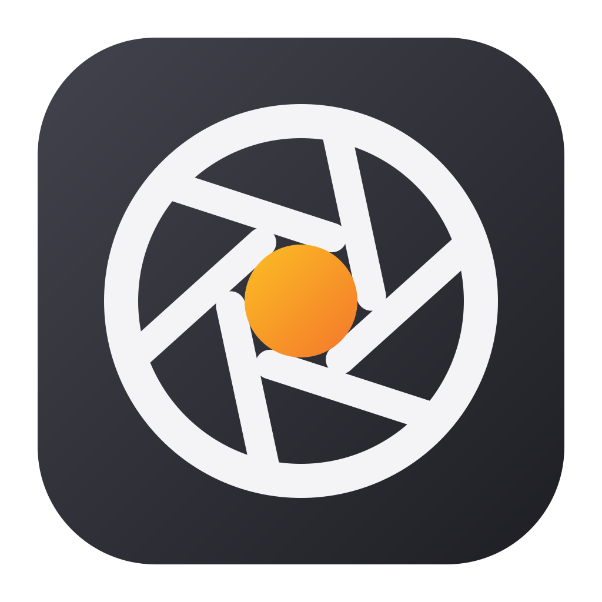
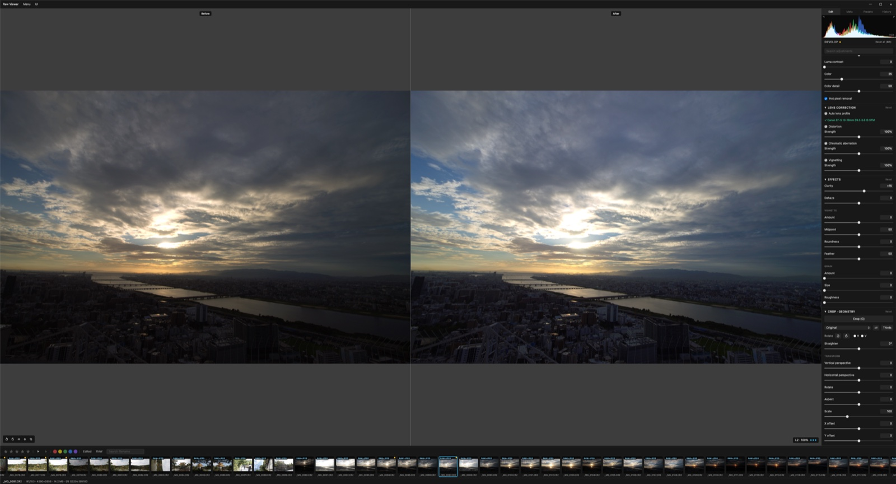

<div align="center">



# Raw Viewer

**A fast, keyboard-driven RAW photo viewer and non-destructive editor for macOS.**

[Download](https://github.com/B-HS/raw-viewer/releases/latest) · [Shortcuts](#keyboard-shortcuts) · [Development](#development)

</div>



Culling hundreds of RAW files should feel instant. Raw Viewer decodes in staged levels (preview → edit quality → 100%), preloads ahead of you, and keeps idle CPU near zero — browsing a full shoot feels like flipping JPEGs.

## Features

- **RAW and everything else** — Canon CR2/CR3, Sony ARW, Nikon NEF/NRW, Fujifilm RAF, Olympus ORF, Panasonic RW2, Pentax PEF, Sigma X3F, DNG, plus JPEG, PNG, TIFF, HEIC/HEIF, AVIF, WebP, BMP, GIF
- **Non-destructive develop** — white balance, tone curve, HSL, noise reduction and sharpening, automatic lens correction (lensfun), effects, crop and geometry; originals are never touched
- **GPU pipeline** — WebGL2 renderer, with an experimental WebGPU backend (compute-shader noise reduction)
- **Culling workflow** — star ratings, pick/reject flags, color labels, filters, RAW+JPEG pairing, grid view, slideshow
- **Export** — batch JPEG/PNG/TIFF (8/16-bit) and DNG, edit presets, copy/paste settings between photos
- **Localized** — English · 한국어 · 日本語

## Install

Download the latest DMG from [Releases](https://github.com/B-HS/raw-viewer/releases/latest) and drag **Raw Viewer** into Applications.

- macOS 13+ on Apple silicon
- Signed and notarized; updates arrive through the built-in updater

## Keyboard shortcuts

| Key | Action |
|-----|--------|
| ← → | Previous / next photo |
| 0–5 | Star rating |
| P / X / U | Pick / reject / clear flag |
| G | Grid view |
| C | Crop |
| Y | Before/after split |
| \ (hold) | Peek original |
| Tab / I | Edit / metadata panel |
| F | Fullscreen |
| ⌘⇧P | Command palette |

Every binding is remappable in Settings.

## Development

```sh
bun install
bun run tauri dev
```

Rust backend (LibRaw FFI, staged decode pipeline) + React frontend (Tauri v2). Architecture notes live in [docs/](docs/).

## License

[MIT](LICENSE)
